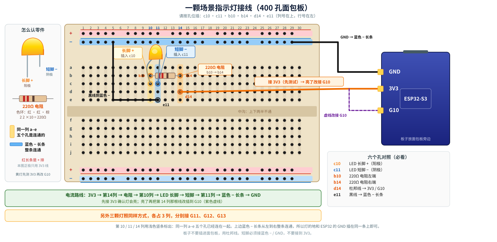

# Lumen 固件（Windows + Arduino IDE 2.x）

ESP32-S3 本地调试固件：四个按键或 **1–4 下拍手** 都走同一条切场路径（场景、对应 LED、OLED、串口 `SCENE:n`、BLE Notify）。已在 Arduino IDE 2.3.10 + **esp32 by Espressif 3.3.11** 上验证；任意 **3.3.x** 均可。

## 安装 Arduino IDE 与 esp32 开发板包

1. 安装 [Arduino IDE 2.x](https://www.arduino.cc/en/software)。
2. **文件 → 首选项 → 其他开发板管理器地址**，添加官方索引：

   `https://espressif.github.io/arduino-esp32/package_esp32_index.json`

3. **开发板管理器** 搜索 **esp32 by Espressif Systems**，安装 **3.3.11**（已验证）。装不到时，3.3.x 都行。
4. **库管理器** 搜索 **Adafruit SSD1306**，点安装，弹出依赖时选 **INSTALL ALL**（会一并装上 Adafruit GFX 和 Adafruit BusIO）。

### 中国大陆：先设代理

官方索引在大陆常超时。先到 **文件 → 首选项 → 网络** 填代理，**必须完全退出并重新打开 IDE** 后代理才生效。仅改代理、不重启，开发板管理器仍然会失败。

### 中国大陆：代理仍不够时，改用乐鑫镜像

代理设好仍装不上时，再加国内镜像：

1. **文件 → 首选项 → 其他开发板管理器地址**，再添加一行：

   `https://jihulab.com/esp-mirror/espressif/arduino-esp32/-/raw/gh-pages/package_esp32_index_cn.json`

2. 完全重启 IDE。
3. **开发板管理器** 里选它列出的最新 **`-cn`** 版本安装。截至 **2026-10-01**，该索引最新是 **3.3.10-cn**，**没有 3.3.12**。固件在 **3.3.11** 上验证过，**任意 3.3.x**（含 3.3.10-cn）都可以。

## 板子与端口（TTL / CH340）

开发板用 **TTL/CH340 USB 口**（例如 COM7），不要用原生 USB。

1. **工具 → 开发板 → esp32 → ESP32S3 Dev Module**
2. **工具 → USB CDC On Boot → Disabled**（走 TTL 口时必须关掉，否则串口监视器一直空白）
3. **工具 → 端口** 选 CH340/TTL 的 COM 口（设备管理器里一般是 CH340）
4. 打开 `firmware/lumen_app/lumen_app.ino`，点上传

烧录失败：按住板上 **BOOT**，点一下 **RST**，松开 BOOT，再点上传。

## 串口监视器

波特率 **115200**。上传后按一下 **RST**，应看到：

```text
BLE ADV Lumen-XXXX
MIC INMP441 SCK=G15 WS=G16 SD=G17
LUMEN READY
SCENE:1
```

`XXXX` 是蓝牙 MAC 后两字节的十六进制（例如 `Lumen-01A4`）。连接网页后还会打印 `BLE CONNECTED`，断开后打印 `BLE DISCONNECTED`，然后再次 `BLE ADV Lumen-XXXX`。

## 接线

板子放在面包板**旁边**，用杜邦线连，不要插进面包板。轻触开关用**对角两脚**（相邻两脚是内部短接的）。

| 功能 | ESP32-S3 | 另一端 |
| --- | --- | --- |
| BTN1 → 场景 1 | **G4**（GPIO4），`INPUT_PULLUP` | 对角另一脚 → **GND** |
| BTN2 → 场景 2 | **G5**（GPIO5），`INPUT_PULLUP` | 对角另一脚 → **GND** |
| BTN3 → 场景 3 | **G6**（GPIO6），`INPUT_PULLUP` | 对角另一脚 → **GND** |
| BTN4 → 场景 4 | **G7**（GPIO7），`INPUT_PULLUP` | 对角另一脚 → **GND** |
| LED1 → 场景 1 | **G10**（GPIO10），阳极、高电平亮 | 长脚（阳极）经 **220 Ω** → G10；短脚（阴极）→ **GND 地排** |
| LED2 → 场景 2 | **G11**（GPIO11），阳极、高电平亮 | 长脚经 **220 Ω** → G11；短脚 → **GND 地排** |
| LED3 → 场景 3 | **G12**（GPIO12），阳极、高电平亮 | 长脚经 **220 Ω** → G12；短脚 → **GND 地排** |
| LED4 → 场景 4 | **G13**（GPIO13），阳极、高电平亮 | 长脚经 **220 Ω** → G13；短脚 → **GND 地排** |
| OLED SDA | **GPIO8** | SSD1306 SDA |
| OLED SCL | **GPIO9** | SSD1306 SCL |
| OLED 电源 | 3V3 / GND | VCC / GND |
| INMP441 SCK | **G15**（GPIO15） | 麦克风 SCK / BCLK |
| INMP441 WS | **G16**（GPIO16） | 麦克风 WS |
| INMP441 SD | **G17**（GPIO17） | 麦克风 SD |
| INMP441 L/R | **GND** | 左声道；VDD 接 **3V3**（不要 5V） |

四颗黄灯：长脚是阳极，经 220 Ω 接到 G10–G13；短脚接到面包板 **GND 地排**（不要接到 3V3）。同一时刻只有当前场景那一颗灯亮，切场时其余三颗立刻灭。



一颗灯：长脚经 220Ω 先接 3V3 测试，亮了再改接到 G10；短脚接到蓝色 − 地排。

OLED 为 **SSD1306 128×64 I2C**（地址多为 `0x3C`）。没接屏幕时固件照常跑，只走串口。

引脚常量在 `lumen_app/config.h` 顶部：`PIN_BTN1`–`PIN_BTN4`、`PIN_LED1`–`PIN_LED4`、`PIN_SDA`、`PIN_SCL`、`PIN_I2S_SCK` / `PIN_I2S_WS` / `PIN_I2S_SD`。

## 串口协议 `SCENE:n`

每次有效按下（约 30 ms 去抖，下降沿触发一次；按住只算一次）打印一行，格式固定，带换行：

```text
SCENE:1
SCENE:2
SCENE:3
SCENE:4
```

BTNn 或一串 **n 下拍手**（n=1–4）都直接切到场景 n，并刷新 OLED 占位数字、点亮对应 LED。上电默认场景 1。拍手检测在 `clap_detector`：组内间隔 150–600 ms，组结束后再安静 600 ms 打印 `CLAPS:n` 再切场；超过 4 下打印 `CLAPS_DROP n=` 且不切。详细测法见 [`lumen_app/README_zh.md`](lumen_app/README_zh.md)。

## 场景灯光（怎么确认接对了）

每颗 LED 只跟自己的场景走，效果都在该场景的 `loop()` 里用 `millis()` 做，没有 `delay()`。切到别的场景时，另外三颗会马上灭。

| 场景 | 按键 / 拍手 / BLE | LED | 灯光 | 怎么看是对的 |
| --- | --- | --- | --- | --- |
| 1 | BTN1 / `SCENE:1` | G10 | 雨滴闪：随机间隔、随机亮度的短闪，然后熄灭再闪 | 只有 LED1 在不规则地亮一下；LED2–4 全灭 |
| 2 | BTN2 / `SCENE:2` | G11 | 鼓点：约每秒 2 下，起来很快、落下也快 | LED2 有节奏地「敲」一下；其余灭 |
| 3 | BTN3 / `SCENE:3` | G12 | 慢呼吸：约 3–4 秒一个来回，中间过渡做了伽马校正 | LED3 匀速地亮—暗循环，没有阶梯感；其余灭 |
| 4 | BTN4 / `SCENE:4` | G13 | 常亮（亮度压过，不刺眼） | LED4 稳定亮着不动；其余灭 |

验证：上电应只有 LED1 在闪。按 BTN2 / BTN3 / BTN4、连拍 2/3/4 下，或用 nRF Connect 往 BLE RX 写 `SCENE:n`，对应灯立刻换成上面那种效果，前一颗马上灭。OLED 数字和串口打印的 `SCENE:n` 必须一起变。串口不读命令；拍手成功时会多一行 `CLAPS:n`。

BLE 使用 Nordic UART：服务 `6e400001-b5a3-f393-e0a9-e50e24dcca9e`，TX/Notify `6e400003-b5a3-f393-e0a9-e50e24dcca9e`，RX/Write `6e400002-b5a3-f393-e0a9-e50e24dcca9e`。通知同样是 `SCENE:n` 这一行（以 `\n` 结尾），和网页解析格式一致。

## M2：用网页测 BLE（Windows 笔记本）

网页会按名称前缀 `Lumen-` 扫描设备，并监听 TX Notify 上的 `SCENE:1`–`SCENE:4`。固件广播名是 `Lumen-XXXX`（MAC 后两字节）。

1. 打开 Windows **蓝牙**（系统托盘或「设置 → 蓝牙和设备」），保持开启。
2. 用 **Chrome 或 Edge**（不要用 Firefox）打开 https://hanjing-laura.vercel.app/lumen/
3. 点右上角 **调试**，再点 **连接 Lumen 按键**（或「连接设备」）。
4. 在弹出的设备列表里选 **Lumen-XXXX**（串口监视器里 `BLE ADV` 那一行就是这个名字）。
5. 网页状态应变为「Lumen 已连接」，串口打印 `BLE CONNECTED`。连接成功后固件会立刻 Notify 当前场景（上电默认 `SCENE:1`）。
6. 按板上 **BTN1–BTN4**，或连拍 1–4 下（组与组隔开约 2 秒）：OLED/串口切场景，对应 LED 亮、其余灭，网页应跟着切到场景 1–4。

### 连不上时

- 确认笔记本蓝牙已打开，且 Chrome/Edge 已允许该站点使用蓝牙。
- 关掉手机 nRF Connect、串口调试助手或其他已经连着这块板的 BLE 软件；Windows 同时只允许一个中央设备连接。
- 必须用 **HTTPS** 页面（上面的 Vercel 地址即可）。`file://` 或普通 http 不能用 Web Bluetooth。
- 只认名字以 `Lumen-` 开头的设备。如果列表是空的：看串口是否已有 `BLE ADV Lumen-XXXX`，板子是否已上电，笔记本是否离板子太远。
- 网页当前**不会**往 RX 写命令；切场靠板上按键或拍手。若用 nRF Connect 向 RX 写入 `SCENE:3` 或 `SCENE:3\n`，固件也会切到场景 3。
